# EMF Official Mafia Rules — Implementable Game Rules

**Source:** English Mafia Federation official rulebook, 24 pages, "Updated 15 July 2026".

> **Disclaimer:** This is an **unofficial working extraction** for implementation planning —
> **not** the official published EMF ruleset. It is derived from a draft that contains proposed
> (not-yet-in-force) provisions; see §0. For the authoritative rules, refer to the EMF directly.

**Authority convention used throughout this document:**
- The **rulebook is authoritative on game rules** — phases, timings, legality, penalties, win conditions.
- The **client spec screenshots are authoritative on UI** — layout, controls, labels, overlay content.
- Where they conflict on a *game rule*, the rulebook wins and the conflict is flagged in §7.

---

## 0. CRITICAL READING CAVEAT — the PDF is a redline draft

Page 17 carries this drafting note:

> *"Drafting note: red text identifies proposed new or replacement wording. Black text is retained from the rules updated 15 July 2026"*

**A significant fraction of the rulebook is coloured red, i.e. PROPOSED, not necessarily in force.**
Red (proposed) articles include, at minimum: **2.4.1–2.4.5, 3.3, 4.2.4, 4.4.5, 4.4.15, 4.5.7,
6.6.10, 6.6.12–6.6.15, 6.7.12, 6.8.5, 6.8.6, 7.9, 8.4.1–8.4.9, all of 8.5, all of 8.6, 8.7, 8.8,
8.9,** and Protocol items **1, 8–17**.

Several of these are load-bearing for the app: **4.2.4** (Sheriff does nothing on night 1),
**4.4.5** (the 1.5-second voting window), **4.4.15** (the all-out vote), **4.5.7** (Sheriff check
gestures), **7.9** (three-way split at nine), and the entire scoring system.

> **ACTION REQUIRED FROM CLIENT (blocking):** confirm whether the red text is in force for the
> tournaments the app will judge, or whether the app must implement the black (current) text and
> gate the red text behind a ruleset flag. Everything below assumes **red text is in force** and
> marks such rules `[PROPOSED]`.

Pages 17–24 are **not rules**. They are a comparative appendix comparing EMF against two other
federations' rulesets. The "Revised EMF" column is used below only as *corroborating gloss*, never
as a primary source, and is cited as `(pp.17–24, comparison appendix)`.

---

## 1. Canonical State Machine

### 1.1 Vocabulary and numbering (resolves OQ-12)

Rulebook 1.3 (p.1): *"The game has several rounds. Each round has two stages: the 'day' stage and
the 'night' stage. The game begins with the night stage."*

The rulebook consistently uses **one-based ordinals with the night first**:

| Canonical name | Rulebook wording | Content |
|---|---|---|
| Night 1 | "the first game night" (4.2, p.2) | Mafia introduction. **No shot.** |
| Day 1 | "the first game day" (4.3.2, 4.4.10, p.3) | Speeches, nominations, vote |
| Night 2 | "the second game night" (4.5, p.4; 8.3, p.8) | **First shooting night.** Best move eligible here only |
| Day 2 | — | … |
| Night N / Day N | (4.6.1, p.4) "the stages alternating until one of the teams wins" | … |

`Round N = Night N followed by Day N.`

**There is no "Night Zero" in the official rules.** The client spec's "Night Zero" == rulebook
**Night 1**; the client spec's "Day 1" == rulebook **Day 1**; the reference product's zero-based
`🌙 0 / ☀️ 0` counter is one below the official numbering throughout.

Known internal inconsistency: article 8.5.1.1 (p.10) says *"during the first voting round / round
zero"*, the only zero-based reference in the document. Treat as a drafting slip; "round zero" there
means **Day 1's first voting round**.

### 1.2 State diagram

```mermaid
stateDiagram-v2
    [*] --> SETUP

    SETUP --> CARD_DISTRIBUTION : judge announces Night falls; all mask (4.1.2)

    state "SETUP<br>(seating, devices surrendered)" as SETUP
    state "CARD_DISTRIBUTION<br>(eyes closed, draw card,<br>unmask, read role, remask,<br>lower head) 4.1.3" as CARD_DISTRIBUTION

    CARD_DISTRIBUTION --> N1_MAFIA_INTRO : all 10 roles drawn

    state "N1_MAFIA_INTRO<br>black unmask, meet,<br>Don self-identifies,<br>Don sets shooting order<br>EXACTLY 60s (4.2.1)" as N1_MAFIA_INTRO
    state "N1_SILENT_WAIT<br>30s. Sheriff does NOTHING.<br>(4.2.4) [PROPOSED]" as N1_SILENT_WAIT

    N1_MAFIA_INTRO --> N1_SILENT_WAIT : judge tells black to mask and fall asleep
    N1_SILENT_WAIT --> DAY_SPEECHES : judge announces the morning

    state "DAY_SPEECHES<br>speakers in seat order from<br>the day's first speaker;<br>60s each; nominations here<br>(4.3.1-4.3.6, 4.4.2-4.4.3)" as DAY_SPEECHES

    DAY_SPEECHES --> VICTORY_CHECK_D : all living players have spoken
    VICTORY_CHECK_D --> VOTE_R1 : vote required
    VICTORY_CHECK_D --> NIGHT_FALLS : no vote (4.4.10 day-1 single candidate,<br/>zero nominations, or 7.1/7.2 cancellation)

    state "VOTE_R1<br>candidates in nomination order;<br>fist on table within ~1.5s;<br>non-voters default to LAST<br>nominee (4.4.4-4.4.9)" as VOTE_R1

    VOTE_R1 --> ELIMINATION : single highest (4.4.11)
    VOTE_R1 --> TIE_SPEECHES : >=2 tied (4.4.12)

    state "TIE_SPEECHES<br>30s each, in nomination order<br>(4.4.12, 4.4.13)" as TIE_SPEECHES
    TIE_SPEECHES --> VOTE_R2

    state "VOTE_R2<br>re-vote among tied only" as VOTE_R2
    VOTE_R2 --> ELIMINATION : single highest
    VOTE_R2 --> TIE_SPEECHES : tied again among FEWER candidates (4.4.14)
    VOTE_R2 --> ALL_OUT_VOTE : tied again among the SAME candidates (4.4.15)
    VOTE_R2 --> NIGHT_FALLS : blocked all-out (4.4.15 tied==all remaining, or 7.9 at nine, or 7.6 after night 3)

    state "ALL_OUT_VOTE<br>'Who is in favour of all nominated<br>players leaving the game?'<br>majority FOR = all leave;<br>against OR tied = all stay<br>(4.4.15) [PROPOSED]" as ALL_OUT_VOTE

    ALL_OUT_VOTE --> ELIMINATION : majority in favour (all tied leave)
    ALL_OUT_VOTE --> NIGHT_FALLS : majority against or tied

    state "ELIMINATION<br>role NOT revealed (4.4.16)" as ELIMINATION
    ELIMINATION --> VICTORY_CHECK_V

    state "VICTORY_CHECK_V<br>evaluate 1.4 immediately" as VICTORY_CHECK_V
    VICTORY_CHECK_V --> GAME_END : decisive vote -> NO final word (7.7)
    VICTORY_CHECK_V --> FINAL_WORD_DAY : not decisive

    state "FINAL_WORD_DAY<br>60s final minute (4.4.16)" as FINAL_WORD_DAY
    FINAL_WORD_DAY --> NIGHT_FALLS

    state "NIGHT_FALLS<br>judge: 'Night falls.'<br>all mask immediately (4.5.1)" as NIGHT_FALLS
    NIGHT_FALLS --> N_SHOOT

    state "N_SHOOT<br>'The Mafia goes hunting.'<br>judge calls numbers 1..10;<br>black shoot eyes closed (4.5.3)" as N_SHOOT
    N_SHOOT --> N_DON : judge: 'The Mafia falls asleep.' (4.5.5)

    state "N_DON<br>'The Don wakes up and looks<br>for the Sheriff.' <=10s,<br>exactly 1 check (4.2.2, 4.5.6, 4.5.8)" as N_DON
    N_DON --> N_SHERIFF : 'The Don falls asleep.'

    state "N_SHERIFF<br>'The Sheriff wakes up.' <=10s,<br>exactly 1 check (4.2.3, 4.5.7, 4.5.8)" as N_SHERIFF
    N_SHERIFF --> BEST_MOVE : killed player exists AND night==2 AND best-move eligible (4.5.9, 8.3.5)
    N_SHERIFF --> MORNING : otherwise

    state "BEST_MOVE<br>'Player number N, you have been<br>killed. Wake up.'<br>player names <=3 numbers, <=20s;<br>judge: 'accepted'; player re-sleeps<br>(4.5.9, 8.3.1-8.3.3)" as BEST_MOVE
    BEST_MOVE --> MORNING

    state "MORNING<br>judge announces 'good morning';<br>night result revealed;<br>role NOT revealed (4.5.4)" as MORNING
    MORNING --> VICTORY_CHECK_N

    state "VICTORY_CHECK_N" as VICTORY_CHECK_N
    VICTORY_CHECK_N --> GAME_END : decisive kill -> NO final word (7.7)
    VICTORY_CHECK_N --> DRAW_CHECK : not decisive

    state "DRAW_CHECK<br>3 consecutive nights with player<br>count unchanged => DRAW (7.6)" as DRAW_CHECK
    DRAW_CHECK --> GAME_END : draw declared
    DRAW_CHECK --> FINAL_WORD_NIGHT : a player was killed
    DRAW_CHECK --> DAY_SPEECHES : miss recorded (no kill)

    state "FINAL_WORD_NIGHT<br>60s final minute (4.5.9)" as FINAL_WORD_NIGHT
    FINAL_WORD_NIGHT --> DAY_SPEECHES : round N+1, first speaker rotates (4.3.2)

    GAME_END --> [*]
```

### 1.3 State table

| # | State | Entry condition | Actor | Duration | Exit / next |
|---|---|---|---|---|---|
| S0 | `SETUP` | 10 players invited | Judge | — | Devices surrendered (3.3); seating fixed randomly or per schedule (4.1.1); judge introduces players → announces **"Night falls."**, all mask (4.1.2) |
| S1 | `CARD_DISTRIBUTION` | masks on | Players | untimed | Eyes closed; each player draws one card, unmasks, reads role, re-masks, lowers head (4.1.3). One card per player, at random, **without repetition** (1.1) |
| S2 | `N1_MAFIA_INTRO` | all roles drawn | Black team | **exactly 60 s** | Black unmask and meet; **only night black players open eyes together**; Don self-identifies and sets the shooting order for later nights (4.2.1). Judge: masks on, "fall asleep" |
| S3 | `N1_SILENT_WAIT` | black asleep | Judge | **30 s** | Sheriff **does not** wake, unmask, signal or identify (4.2.4) `[PROPOSED]`. Judge announces the morning |
| S4 | `DAY_SPEECHES` | morning announced | Each living player in turn | **60 s each** | Masks off (4.3.1, 4.3.6). Order = seat order from the day's first speaker (4.3.2). Nominations made inside the minute (4.4.2). Speech ends with "Thank you." (4.3.5) |
| S5 | `VOTE_R1` | all living have spoken; ≥1 nomination; vote not cancelled | Living players | ~1.5 s per candidate | Candidates called in nomination order (4.4.4); vertical fist on table (4.4.5) |
| S6 | `TIE_SPEECHES` | ≥2 candidates tied on top | Tied players, in nomination order | **30 s each** | (4.4.12, 4.4.13) |
| S7 | `VOTE_R2` | tie speeches done | Living players | ~1.5 s per candidate | Re-vote among tied candidates only |
| S8 | `ALL_OUT_VOTE` | second round tied among the **same** candidates | Living players | one show of hands | Question: *"Who is in favour of all nominated players leaving the game?"* (4.4.15) `[PROPOSED]` |
| S9 | `ELIMINATION` | outcome determined | Judge | instant | Role **not** revealed (4.4.16) |
| S10 | `FINAL_WORD_DAY` | elimination, game not decided | Eliminated player | **60 s** | (4.4.16) |
| S11 | `NIGHT_FALLS` | day resolved | Judge | instant | *"Night falls."* All players **immediately** mask (4.5.1) |
| S12 | `N_SHOOT` | night begun (Night ≥ 2) | Black team | untimed | *"The Mafia goes hunting."* Judge announces **numbers 1 to 10** (4.5.3). Black shoot eyes closed by extending hand imitating a shot |
| S13 | `N_DON` | *"The Mafia falls asleep."* | Don | **≤ 10 s** | Don unmasks, shows one number; judge nods yes/no (4.5.6). Exactly one check (4.5.8) |
| S14 | `N_SHERIFF` | *"The Don falls asleep."* | Sheriff | **≤ 10 s** | Sheriff unmasks, shows one number; judge signals (4.5.7). Exactly one check (4.5.8) |
| S15 | `BEST_MOVE` | Night 2 only, a player was killed, and best move not barred by 8.3.5 | Killed player | **≤ 20 s** | *"Player number …, you have been killed. Wake up."* Player names up to three numbers; judge says "accepted"; player sleeps again (4.5.9) |
| S16 | `MORNING` | night resolved | Judge | instant | *"good morning"* (4.5.9). Kill or miss announced; role **not** revealed (4.5.4) |
| S17 | `FINAL_WORD_NIGHT` | a player was killed and game not decided | Killed player | **60 s** | (4.5.9, 4.5.4) |
| S18 | `GAME_END` | 1.4 satisfied, or 7.6 draw | Judge | — | Protocol completion (pp.15–16) |

### 1.4 Ordering points that are easy to get wrong

1. **Role assignment is a physical card draw that happens *after* "Night falls."** — not in Setup
   (4.1.2 → 4.1.3, p.2). See OQ-13 in §6.
2. **Night order is fixed: Mafia shot → Don check → Sheriff check.** (4.5.3 → 4.5.6 → 4.5.7).
   Matches the client spec.
3. **The best move happens at the END OF THE NIGHT, before "good morning"**, while every other
   player is still masked and asleep (4.5.9). The client spec places it in Morning — see §7-C3.
4. **The night-kill victim's final minute is given in the morning**, after "good morning"
   (4.5.9), i.e. it is the first speech of the day and precedes the ordinary speaking order.
5. **Victory must be evaluated at the instant of the decisive vote or kill**, because 7.7
   suppresses the final word and 6.8.6 suppresses most penalties from that instant onward.
6. On **Night 1 there is no shot, no Don check and no Sheriff check** (4.5.2: *"During this night
   and later nights, the Mafia may 'shoot'"*, of the *second* night onward).

---

## 2. Numbered Rules

Format: `GR-n` — statement — `(article, page)`. `[PROPOSED]` = red draft text (see §0).
`[INFERRED]` = not stated; derived.

### 2.1 Composition and setup

| ID | Rule | Cite |
|---|---|---|
| GR-1 | A game is played by **exactly 10 players**. | 1.1, p.1 |
| GR-2 | The role-card deck is **1 Sheriff + 6 Civilian = 7 red**, **1 Don + 2 Mafia = 3 black**, total 10. | 1.1 table, p.1 |
| GR-3 | The judge shows each player one card **at random and without repetition**, discreetly from the other players. | 1.1, p.1 |
| GR-4 | The game is managed by one judge; **assistant judges may help**. | 1.2, p.1 |
| GR-5 | The game table must accommodate 10 players; the judge sits at or near the table with full sight and hearing of it. | 2.1, p.1 |
| GR-6 | **Every seat has a number marker and a game mask.** | 2.2, p.2 |
| GR-7 | The game area must have speakers or other sound equipment for the night stage. | 2.3, p.2 |
| GR-8 | Ten players are invited to the table; **seating is assigned randomly by the (table) judge immediately before the game begins, or as specified in the schedule**. | 4.1.1, p.2; replay appendix p.14 |
| GR-9 | **Before role cards are distributed**, players must remove or hand to the judge: mobile phones, smart watches, other electronic devices, sunglasses, and large or reflective jewellery. | 3.3, p.2 `[PROPOSED]` |
| GR-10 | A necessary medical, accessibility or communication device may be used **only with prior approval of the chief judge**. | 3.3, p.2 `[PROPOSED]` |
| GR-11 | A player may use their own face mask **only if the judge permits it**. | 3.4, p.2 |
| GR-12 | A player may remain in the game area only while participating in the game process. | 3.1, p.2 |
| GR-13 | The judge introduces the players and announces the start with the phrase **"Night falls."**; all players put on masks. | 4.1.2, p.2 |
| GR-14 | With eyes closed, each player chooses a card, removes their mask, learns their role, replaces the mask, and lowers their head. | 4.1.3, p.2 |

### 2.2 Official language

| ID | Rule | Cite |
|---|---|---|
| GR-15 | The official language of EMF tournaments is **English**, unless tournament regulations designate **another single** official language. | 2.4.1, p.2 `[PROPOSED]` |
| GR-16 | Every player, table judge and assistant judge must understand the official language. | 2.4.2, p.2 `[PROPOSED]` |
| GR-17 | The official language must be used for **speeches, nominations, final words, and all other audible game communication**. | 2.4.3, p.2 `[PROPOSED]` |
| GR-18 | Player nicknames and commonly understood game terms are **not** a change of language. | 2.4.4, p.2 `[PROPOSED]` |
| GR-19 | Switching language to conceal information or to prevent others understanding is prohibited. | 2.4.5, p.2 `[PROPOSED]` |
| GR-20 | First use of another language after a judge's reminder = **foul** (6.6.15). Deliberate concealment, or continued use after that foul = **disqualifying foul** (6.7.12). | 6.6.15, 6.7.12, p.7 `[PROPOSED]` |

### 2.3 Night 1 (the introductory night)

| ID | Rule | Cite |
|---|---|---|
| GR-21 | On the judge's announcement, **black-card players remove their masks and get to know each other**. This is the **only** night on which black players open their eyes together. | 4.2.1, p.2 |
| GR-22 | The Don indicates that they are the Don and **determines the shooting order for the following nights**. | 4.2.1, p.2 |
| GR-23 | The black team has **exactly one minute** for the introduction. | 4.2.1, p.2 |
| GR-24 | After the black team masks and "falls asleep", the judge **waits 30 seconds** before announcing the morning. | 4.2.4, p.3 `[PROPOSED]` |
| GR-25 | **The Sheriff does not wake up, remove their mask, signal to the judge, or otherwise identify themselves during the first game night.** | 4.2.4, p.3 `[PROPOSED]` |
| GR-26 | No shot is taken on the first game night. | 4.5.2, p.4 (by implication) |

### 2.4 Day stage and speeches

| ID | Rule | Cite |
|---|---|---|
| GR-27 | The judge announces the day stage; **players remove their masks**. | 4.3.1, p.3 |
| GR-28 | Each player is given **one minute on each game day** to speak and to nominate candidates for voting. | 4.3.1, p.3 |
| GR-29 | Players speak **in turn according to their seating order**. | 4.3.2, p.3 |
| GR-30 | **Player number 1 begins the discussion on the first game day.** | 4.3.2, p.3 |
| GR-31 | Each subsequent day's discussion begins with **the next player after the one who spoke first on the previous day**. | 4.3.2, p.3 |
| GR-32 | A player may address others by **game nickname or by number**. | 4.3.3, p.3 |
| GR-33 | A player addresses the judge as **"Mr./Ms. Judge"** or **"Mr./Ms. Host."** | 4.3.4, p.3 |
| GR-34 | Players end their speeches with the words **"Thank you."** | 4.3.5, p.3 |
| GR-35 | Players are **not allowed to wear masks during the day stage**. Refusal to remove on request → foul, repeated up to the fourth foul; deliberate repeated provocation → fouls without warning. | 4.3.6, p.3; mask appendix, pp.13–14 |
| GR-36 | Refusing to remove the mask at the judge's request is a listed foul. | 6.6.9, p.6 |

### 2.5 Nominations

| ID | Rule | Cite |
|---|---|---|
| GR-37 | A nomination may be made **only during the nominating player's own minute**. | 4.4.2, p.3 |
| GR-38 | The nomination is made **in the present tense** with the phrase **"I nominate player number …"**. | 4.4.2, p.3 |
| GR-39 | The judge responds **"accepted"** if the nomination is accepted. | 4.4.2, p.3 |
| GR-40 | A player may nominate **any** player. | 4.4.2, p.3 |
| GR-41 | A player may nominate **only one candidate during each day minute**. | 4.4.3, p.3 |
| GR-42 | Voting is conducted **in the order in which candidates were nominated**. | 4.4.4, p.3 |
| GR-43 | A player has **no right to receive information from the judge about which players were nominated**. | 7.4, p.8 |
| GR-44 | Nomination order is preserved through tie-break speeches and re-votes. | 4.4.13, p.3 |

### 2.6 Voting

| ID | Rule | Cite |
|---|---|---|
| GR-45 | The vote is held at the end of the day discussion, **only among nominated players**. | 4.4.1, p.3 |
| GR-46 | To vote against a player, a player places a **vertical fist on the game table immediately after the candidate is announced**. | 4.4.5, p.3 `[PROPOSED]` |
| GR-47 | A vote counts **only if the hand touches the table before the final sound of the judge's word "stop" or "thank you."** A vote first placed after that moment is **not accepted**. | 4.4.5, p.3 `[PROPOSED]` |
| GR-48 | The judge should allow **approximately 1.5 seconds for each candidate**. | 4.4.5, p.3 `[PROPOSED]` |
| GR-49 | A player must keep their hand on the table **until the judge announces the number of votes cast**. | 4.4.6, p.3 |
| GR-50 | A player may vote against **only one candidate** during the vote. | 4.4.7, p.3 |
| GR-51 | **If a player does not vote, their vote falls against the last nominated player.** | 4.4.8, p.3 |
| GR-52 | If a player removes their hand after it has touched the table, **the vote is still counted**. | 4.4.9, p.3 |
| GR-53 | **No vote is held if only one candidate is nominated on the first game day.** | 4.4.10, p.3 |
| GR-54 | On days after the first, if only one candidate is nominated, **that candidate is eliminated by all possible votes** that day. | 4.4.10, p.3 |
| GR-55 | The player with the **highest number of votes** leaves the game. | 4.4.11, p.3 |
| GR-56 | **Corollary of GR-51:** across all candidates the vote counts must sum to the number of living players eligible to vote. Any aggregate entry violating this is invalid. | `[INFERRED]` from 4.4.8 |
| GR-57 | Voting against oneself is **not prohibited** by the rules; it is only penalised in scoring (8.5.1.1 penalises a red player who "voted against another red player, **or against themselves**"). | 8.5.1.1, p.10 `[INFERRED]` — see §7-C7 |

### 2.7 Ties

| ID | Rule | Cite |
|---|---|---|
| GR-58 | If **two or more** players receive the same (highest) number of votes, they each receive an **additional 30 seconds** to speak, then a **second round of voting** is held among them. | 4.4.12, p.3 |
| GR-59 | The tie speeches and the second round are conducted **in the order of their nominations**. | 4.4.13, p.3 |
| GR-60 | If the votes are tied again **among fewer candidates**, those with equal votes receive **another 30 seconds** and **another round of voting** is held. | 4.4.14, p.4 |
| GR-61 | If the votes are tied again **among the same candidates**, the judge puts to a vote: **"Who is in favour of all nominated players leaving the game?"** | 4.4.15, p.4 `[PROPOSED]` |
| GR-62 | If the **majority votes in favour**, all nominated players leave the game. | 4.4.15, p.4 `[PROPOSED]` |
| GR-63 | If the majority votes **against**, **or if the votes are tied**, the players **remain** in the game. | 4.4.15, p.4 `[PROPOSED]` |
| GR-64 | **No all-out vote is held where the tied candidates comprise every player remaining at the table.** All players remain and the judge announces the night. | 4.4.15, p.4 `[PROPOSED]` |
| GR-65 | When **nine players remain**, three may be nominated and receive equal votes, but **no vote is held to eliminate all three**. If the same three receive equal votes in two consecutive voting rounds, all three remain and the judge announces **"Night falls."** | 7.9, p.8 `[PROPOSED]` |
| GR-66 | **After the third night** (see GR-97), no vote is held to eliminate all players currently at the table. | 7.6, p.8 |

### 2.8 Elimination and final word

| ID | Rule | Cite |
|---|---|---|
| GR-67 | **The role of an eliminated player is not revealed** — for vote eliminations and for night kills alike. | 4.4.16, p.4; 4.5.4, p.4 |
| GR-68 | An eliminated player is entitled to **one final minute of speech**. | 4.4.16, p.4; 4.5.4, p.4 |
| GR-69 | **When one of the teams wins as a result of a decisive vote or kill, the last player leaving does not have a final-word speech.** | 7.7, p.8 |
| GR-70 | A player removed on a fourth foul or a disqualifying foul **leaves immediately without a final word**. | 6.5, p.6 |
| GR-71 | The night-kill victim's final minute is given **after the judge announces "good morning"** — i.e. it opens the day stage. | 4.5.9, p.4 |

### 2.9 Night stage (Night 2 onward)

| ID | Rule | Cite |
|---|---|---|
| GR-72 | At the end of the day the judge announces **"Night falls."** All players must **immediately** put on masks. | 4.5.1, p.4 |
| GR-73 | The judge announces **"The Mafia goes hunting."**, then **announces the player numbers from 1 to 10**. | 4.5.3, p.4 |
| GR-74 | Black-team players shoot **with their eyes closed**, by extending a hand and imitating a shot with the fingers. | 4.5.3, p.4 |
| GR-75 | **If the black-team players shoot the same player, that player leaves the game after the night.** | 4.5.4, p.4 |
| GR-76 | **A miss is recorded** — and no one leaves the game — if any black-team member does not shoot the same player, shoots several players, or does not shoot at all. | 4.5.5, p.4 |
| GR-77 | After the shooting the judge announces **"The Mafia falls asleep."** | 4.5.5, p.4 |
| GR-78 | The judge announces **"The Don wakes up and looks for the Sheriff."** The Don removes their mask and shows the judge the number of the player they suspect is the Sheriff. **The judge nods yes or no.** Then: **"The Don falls asleep."** | 4.5.6, p.4 |
| GR-79 | The Don's check takes **no more than 10 seconds**. | 4.2.2, p.3 |
| GR-80 | The judge announces **"The Sheriff wakes up."** The Sheriff removes their mask and shows the number to check. **If the checked player is red, the judge shakes their head and raises their thumb. If the checked player is black, the judge nods and lowers their thumb.** Then: **"The Sheriff falls asleep."** | 4.5.7, p.4 `[PROPOSED]` |
| GR-81 | The Sheriff's check takes **no more than 10 seconds**. | 4.2.3, p.3 |
| GR-82 | **The Don and the Sheriff may perform only one check on each game night.** | 4.5.8, p.4 |
| GR-83 | During the night, players must sit **leaning approximately 45 degrees forward** from vertical. | 4.5.10, p.4 |
| GR-84 | During the night it is **forbidden to sing, dance, speak, touch other players, eat, drink, smoke, or perform any other action**. | 4.5.11, p.4 |

> **GR-80 gesture polarity is counter-intuitive and is stated twice** (4.5.7 and the comparison
> table on p.20: *"Red: head shake and thumb up. Black: nod and thumb down."*). Implement exactly
> as written; do not "correct" it.

### 2.10 Best move

| ID | Rule | Cite |
|---|---|---|
| GR-85 | The right to make a best move belongs **only to the player killed on the second game night** — *"the first night after the Mafia had an opportunity to coordinate"* — unless the rules provide otherwise. | 4.5.9, p.4; 8.3, p.8 |
| GR-86 | **A player has no right to make the best move if, as a result of the vote on the first game day, two or more players left the game.** | 8.3.5, p.9; 7.8, p.8 |
| GR-87 | The judge announces **"Player number …, you have been killed. Wake up."**; the player removes their mask and **verbally states three numbers** corresponding to players they consider black. | 4.5.9, p.4 |
| GR-88 | The player has **no more than 20 seconds** to make this decision. | 4.5.9, p.4 |
| GR-89 | The numbers must be named **in sequence** and entered into the game protocol; **the judge repeats those numbers and says "accepted."** | 8.3.1, p.9 |
| GR-90 | **If the player reveals any information about the game, addresses another player, or makes statements that cause reactions from other players, the best move ends.** The judge accepts **only the numbers named up to that point** — which may be fewer than three. | 8.3.2, p.9 |
| GR-91 | **The numbers named in the best move cannot be changed or added to later.** | 8.3.3, p.9 |
| GR-92 | After the best move the judge announces "accepted", the player **falls asleep again**, and only then does the judge announce "good morning". | 4.5.9, p.4 |
| GR-93 | The best move may be **cancelled or not used**; the protocol records this case explicitly. | Protocol item 8, p.16 `[PROPOSED]` |

### 2.11 Win conditions and game end

| ID | Rule | Cite |
|---|---|---|
| GR-94 | **The red team wins when all members of the black team have been eliminated from the game.** | 1.4, p.1 |
| GR-95 | **The black team wins if there is an equal number of players from the two teams at the table, or if the number of black players is greater than the number of red players.** | 1.4, p.1 |
| GR-96 | **A player is eliminated either by a vote or by a night kill.** (Removal under 6.5 is a third mechanism; see §5-E7.) | 1.4, p.1 |
| GR-97 | **If three consecutive nights pass in the game and the number of players remains unchanged, a draw is declared.** | 7.6, p.8 |
| GR-98 | After that third night, no vote is held to eliminate all players currently at the table. | 7.6, p.8 |
| GR-99 | On the following days and nights the game continues without change, the stages alternating **until one of the teams wins**. | 4.6.1, p.4 |

### 2.12 Fouls, removal and team-loss penalties

| ID | Rule | Cite |
|---|---|---|
| GR-100 | **Rule violations are recorded by the judge.** | 6.1, p.6 |
| GR-101 | The possible penalties are: **verbal warning, foul, disqualification from the game or tournament, or a loss attributed to the team** of the violating player. | 6.3, p.6 |
| GR-102 | If a player violates several **different** rules, the sanctions **accumulate**. | 6.3.1, p.6 |
| GR-103 | If several rules are violated simultaneously and the penalty for each is a foul, **the fouls accumulate**. | 6.3.2, p.6 |
| GR-104 | If a player is disqualified and later commits a new violation, they receive penalty points for the **more serious** violation. | 6.3.3, p.6 |
| GR-105 | **On the third foul, the player loses the right to speak during their next minute, but keeps the right to nominate a candidate for voting.** | 6.4, p.6 |
| GR-106 | **On the fourth foul, or on a disqualifying foul, the player must leave the game immediately without a final word.** | 6.5, p.6 |
| GR-107 | **Exception:** a player who receives their third foul and finds themselves in the **second or a later voting round** may speak. | 7.5, p.8 |
| GR-108 | **Exception:** a player with 3 fouls whose next speech before voting occurs when **only 3 or 4 players remain** is given **30 seconds** to speak. | 7.5, p.8 |
| GR-109 | **Foul-triggering violations (6.6):** speaking outside one's minute incl. calls/interruptions/whispers/understandable expression (6.6.1); excessive hand movements (6.6.2); touching others during the day (6.6.3); knocking on the table or unethical behaviour toward players, judges, federations or the venue (6.6.4); arguing with the judge (6.6.5); withdrawing a hand during voting before results are announced / before "stop"/"thank you", or placing a hand on the table before voting (6.6.6); hand movements and appeals during the voting stage (6.6.7); violating voting procedure (6.6.8); refusing to remove the mask on request (6.6.9). | 6.6.1–6.6.9, p.6 |
| GR-110 | **Foul:** sustained shouting, pleading, exaggerated emotional performance or physical displays of emotion used to prove a role, influence a vote, or interfere with another player's minute. **Speaking emotionally, showing excitement or frustration, or briefly raising one's voice is not, by itself, a violation.** | 6.6.10, p.6 `[PROPOSED]` |
| GR-111 | **Foul:** any use of a metaphor to create positional game power. Permitted: "sealed", "sure", "certain". Forbidden: the name of a house, the name of a galaxy. | 6.6.11, p.6 |
| GR-112 | **Foul:** deliberately adopting a posture demonstrating disrespect or refusal to listen during another player's speech (turning away, covering ears, prolonged eye-closing, lying across the table, repeated visible refusal to engage). Brief eye-closing, natural posture change, or an agreed accessibility/medical adjustment is **not** a violation. | 6.6.12, p.6 `[PROPOSED]` |
| GR-113 | **Foul:** describing another participant generally as a "strong player" or "weak player" relying on reputation or status **outside** the current game. Describing a particular argument, vote, move or game position as strong or weak is permitted. | 6.6.13, p.7 `[PROPOSED]` |
| GR-114 | **Foul:** personal or organisational attacks that are not legitimate analysis, including accusing another player of cheating, fixing, throwing, or deliberately losing for reasons outside the game. **"Fourth black" and similar game expressions are permitted** unless accompanied by a separate personal insult. | 6.6.14, p.7 `[PROPOSED]` |
| GR-115 | **Disqualifying fouls (6.7 — removal from the game):** unauthorised leaving of the table (6.7.1); touching others at night (6.7.2); signalling by gestures to the Don or Sheriff at night (6.7.3); insulting players, judges or spectators (6.7.4); unintentional peeking at night (6.7.5); night conversations, shouting or other breach of night conduct (6.7.6); **crying (6.7.7)**; ethical/religious or out-of-game appeals to prove a role or influence the vote (6.7.8); voting with palm, finger, elbow etc. (6.7.9); intentional peeking or other out-of-game information gathering (6.7.10); concealed whispering into a neighbour's ear (6.7.11); deliberate language concealment (6.7.12); curses and obscene language (6.7.13); attempting to gain an unfair advantage to prove a role or influence a vote (6.7.14); obscene signalling (6.7.15). | 6.7.1–6.7.15, p.7 |
| GR-116 | **Team-loss violations (6.8 — penalty points and a loss attributed to the player's team):** oaths/bets or equivalents (6.8.1); blackmail, threats or bribery (6.8.2); hints from the audience (6.8.3); proving the Sheriff role through unique night information (6.8.4). | 6.8.1–6.8.4, pp.7–8 |
| GR-117 | Committing a violation of 6.7.4, 6.7.7, 6.7.8, 6.7.12, 6.7.13 or 6.7.14 **during the final speech, or after being eliminated by vote**, also carries the team-loss penalty. | 6.8.5, p.8 `[PROPOSED]` |
| GR-118 | **After a kill or vote that determines the result of the game, the penalties in 6.7.2–6.7.3, 6.7.5–6.7.14 and 6.8.1–6.8.5 are not applied.** | 6.8.6, p.8 `[PROPOSED]` |
| GR-119 | For intentional peeking, other out-of-game information methods, or insulting the judge or chief judge, the player **may be disqualified from the tournament** (not merely the game). | 7.3, p.8 |
| GR-120 | **Crying clarification:** the player should be disqualified as soon as a visible "almost crying" state is apparent. Players may not cover their eyes with mask, hands or clothing during the day; if they refuse to uncover on request, the judge may disqualify. **Do not disqualify** where the tears provably had no effect on the game, where the crying follows the decisive vote, or where the tears are from laughter — punishing these is "a serious mistake". **Do** remove a player who cries in all versions in which they are red because they cannot persuade others. | Clarification of 6.7.7, p.13 |

### 2.13 Consequences of mid-game removal

| ID | Rule | Cite |
|---|---|---|
| GR-121 | If a player leaves the table after a fourth or disqualifying foul, **the upcoming or current vote will not be held** — unless that player was killed during the night or was removed from the game as a result of a vote. | 7.1, p.8 |
| GR-122 | If a player leaves the table after a fourth or disqualifying foul **after the current day's vote result has been determined**, and they were not removed by that vote, **the next day's vote will not be held**. | 7.2, p.8 |
| GR-123 | **If no vote is held on a given day, that day's voting results are considered determined when the judge announces the start of the night stage.** | 7.2, p.8 |

### 2.14 Judge conduct, errors and corrections

| ID | Rule | Cite |
|---|---|---|
| GR-124 | Disputed situations divide into **technical mistakes by judges** and **disputed judging decisions**; each is either **correctable** or **not correctable**. | p.14 |
| GR-125 | **Correctable errors** are those whose consequences have not yet irreversibly affected the game — where no information about players' colours or teams has entered the table as a result of the error, and no irreversible action (voting, Sheriff confrontations, etc.) has been performed. | p.14 |
| GR-126 | **Technical errors** include: showing the wrong colour to the Don or Sheriff during a check; incorrectly counting the result of night shooting; a decision that contradicts the current version of the rules; giving a disqualification or team loss where the alleged violation is clearly absent (→ agree and order a replay). | p.15 |
| GR-127 | A correctable technical mistake may be corrected **immediately or after announcing a technical break**, during which **all players put on masks and remain silent**. During the break the judge may consult the side judge or the chief judge. | p.15 |
| GR-128 | After an appeal, **the result may be changed** where: the judge clearly miscounted votes in a decisive vote that determined the result; the judge clearly failed to count a shot after which the black team should have won; the judge failed to remove a player for a clear violation where removal would have produced a win. **In other cases, a replay is usually ordered.** | p.15 |
| GR-129 | **If a tournament game is replayed, for any reason, the seating arrangements must be changed.** Seating may be changed by coin toss immediately before the game, or by the chief judge through the web portal. | p.14 |
| GR-130 | **A replay may be held without changing seating only if the game was stopped before roles had been fully assigned. After roles have been assigned, every replay must change seating.** | p.14 |
| GR-131 | When changing seating through the web portal, care must be taken **not to alter seating for games already played**, because that causes loss of results for those games. | p.14 |
| GR-132 | If a significant out-of-game advantage affecting the game is discovered after the game ends, the chief judge — **with the consent of the duty Judges' Committee representative supervising the tournament** — may change the game result, or cancel it and order a replay. | 8.9, p.12 `[PROPOSED]` |

### 2.15 Assistant (side) judge

| ID | Rule | Cite |
|---|---|---|
| GR-133 | The assistant judge may help distribute cards (especially via a tray), watch players in areas not visible to the chief judge during night and day, **additionally mark the black team's shooting results**, **additionally mark voting results**, convey missed events/violations/calls to the chief judge, and maintain order. | Assistant Judge 1.1–1.8, p.12 |
| GR-134 | Judges **must not react in any way** to roles assigned during card distribution — no facial expressions, no visible interest. Experienced players at the end of the deal can otherwise infer information. | Assistant Judge 2.1, p.12 |
| GR-135 | Judges must confirm prohibited items are surrendered **before** players receive their role. | Assistant Judge 2.2, p.12 |
| GR-136 | **Adjusting a player's mask or night posture is prohibited after that player has received their role.** If adjustment is necessary it must not be selective: the chief judge asks *all* players to adjust until the specific player has. Selective adjustment immediately before Mafia shooting signals that the player is almost certainly red. | Assistant Judge 2.3, p.12 |
| GR-137 | A judge must **never indicate a player's role during card distribution**, even after the mask is back on — e.g. tapping a shoulder while pointing at the Sheriff can be heard and inferred. | Assistant Judge 2.4, p.12 |
| GR-138 | **Used role cards must be removed from view. Under no circumstances may players see the role cards that were dealt.** | Assistant Judge 2.5, p.12 |
| GR-139 | Fouls for secret touching should be signalled by motion or whispered to the host. **If the touch occurred at night, wait until the end of the Sheriff check stage and report before morning.** | Assistant Judge 2.6, p.12 |
| GR-140 | Judges must not react to speech or enter dialogue with players during the game; shouting at or criticising players after the game is prohibited. | Assistant Judge 2.7, p.13 |

### 2.16 Protocol (what the app must record)

| ID | Rule | Cite |
|---|---|---|
| GR-141 | **Only the official EMF game protocol is used** in all tournaments; it is completed **by the game judges**. | Protocol 1, p.15 `[PROPOSED]` |
| GR-142 | Before the game the judge prepares the protocol and records in advance: tournament name, tournament stage, game sequence number, game-table number, game date, nickname of the judge conducting the game. | Protocol 2–3, p.15 |
| GR-143 | After game positions are determined, the judge enters the players' nicknames in the appropriate columns. | Protocol 4, p.15 |
| GR-144 | During the game the judge records: **fouls, voting calls and the number of votes**. | Protocol 5, p.15 |
| GR-145 | In the **"kill" column** the judge records the night kill result. **Misses are marked with an X or a dash.** | Protocol 6, p.15 |
| GR-146 | In the voting table's **"result" column**, the numbers of the players eliminated by vote are recorded. **If no one leaves the game, an X or dash is marked.** | Protocol 7, p.15 |
| GR-147 | In the **"best move" column** the judge records the number of the player killed on the first shooting night and that player's choice; a miss is X/dash; if the best move was cancelled or not used, only the killed player's number is recorded. The judge must also record whether that player was **red or Sheriff** and whether the red team lost, so first-kill compensation can be calculated. | Protocol 8, p.16 `[PROPOSED]` |
| GR-148 | At the end of the game the judge fills the **"winning team"** column with **"town" or "mafia"**. | Protocol 9, p.16 `[PROPOSED]` |
| GR-149 | At the end of the game the judge fills the **"role"** column: **C = red player, M = black player, Sh = Sheriff, D = Don**. Only the role is recorded in the protocol. | Protocol 10, p.16 `[PROPOSED]` |
| GR-150 | The judge must record, in the "comments"/"explanation" columns, the **rationale for every additional point** (with player number and amount), the **rationale and rule section for any disqualification**, and the **rule section under which a fourth foul was received**. | Protocol 14–17, p.16 `[PROPOSED]` |

### 2.17 Appeals

| ID | Rule | Cite |
|---|---|---|
| GR-151 | A player has the right to appeal the result of the game. | 8.8, p.11; Appeal Rules 1, p.14 |
| GR-152 | Appeals must be recorded in the appropriate protocol column **within 10 minutes of the end of the game** (tournament), or by written protest **about 5 days after the end date of a league round**. | 8.8.1, p.11; Appeal Rules 1.1, p.14 |
| GR-153 | Appeals are reviewed by the **chief judge plus two independent members of the EMF Appeals Panel who did not judge the game**. An appeal concerning a game judged by the chief judge is reviewed by **three independent Judges' Committee members**. | Appeal Rules 1.2, p.14 `[PROPOSED]` |
| GR-154 | The decision-maker may use video recordings, question judges, line judges and players, and involve the Judges' Committee. | 8.8.3, p.12; Appeal Rules 1.3, p.14 |
| GR-155 | Possible outcomes: reject; accept without changing the result; cancel penalty points; change points awarded; order a replay; change the game result. | Appeal Rules 1.4, p.14 |
| GR-156 | **The chief judge's / appeals committee's decision is final and cannot be appealed or reviewed further within that tournament.** | 8.8.4, p.12; Appeal Rules 1.5, p.14 |
| GR-157 | After a game, at the players' request, the judge **must** provide informational explanations about fouls and state the rule-section number under which the player received penalty points, disqualification, or 4 fouls. | Appeal Rules, p.14 |

---

## 3. Timing Table

Every duration, limit and count stated in the rulebook.

| Value | Applies to | Article | Page | Notes |
|---|---|---|---|---|
| **10** | Players per game | 1.1 | 1 | Hard; no alternative composition exists |
| **7 / 3** | Red / black players | 1.1 | 1 | |
| **1 / 6** | Sheriff / Civilian cards | 1.1 | 1 | |
| **1 / 2** | Don / Mafia cards | 1.1 | 1 | |
| **60 s (exactly)** | Black-team introduction, Night 1 | 4.2.1 | 2 | *"exactly one minute"* |
| **30 s** | Judge's silent wait after black sleeps, Night 1 | 4.2.4 | 3 | `[PROPOSED]` |
| **≤ 10 s** | Don's check, each night from Night 2 | 4.2.2 | 3 | |
| **≤ 10 s** | Sheriff's check, each night from Night 2 | 4.2.3 | 3 | |
| **1 check** | Per night, per Don and per Sheriff | 4.5.8 | 4 | |
| **60 s** | Each player's day speech | 4.3.1 | 3 | "one minute on each game day" |
| **1** | Nominations allowed per player per day minute | 4.4.3 | 3 | |
| **~1.5 s** | Voting window per candidate | 4.4.5 | 3 | `[PROPOSED]` |
| **1** | Candidates a player may vote against | 4.4.7 | 3 | |
| **30 s** | Tie-break speech, each tied player, each tie round | 4.4.12, 4.4.14 | 3–4 | |
| **60 s** | Final minute for an eliminated player | 4.4.16, 4.5.4 | 4 | Suppressed by 7.7 and 6.5 |
| **1..10** | Numbers announced by judge during Mafia shooting | 4.5.3 | 4 | All ten, every night |
| **≤ 20 s** | Best-move decision | 4.5.9 | 4 | |
| **3** | Numbers named in a best move | 4.5.9, 8.3 | 4, 8 | Fewer accepted if truncated by 8.3.2 |
| **~45°** | Forward lean, night posture | 4.5.10 | 4 | |
| **3 fouls** | → loses next speaking minute, keeps nomination right | 6.4 | 6 | |
| **4 fouls** | → immediate removal, no final word | 6.5 | 6 | |
| **30 s** | Speech for a 3-foul player when only 3 or 4 players remain | 7.5 | 8 | |
| **3 consecutive nights** | Unchanged player count → **draw** | 7.6 | 8 | |
| **9 players** | Threshold for the three-way-split special rule | 7.9 | 8 | `[PROPOSED]` |
| **2 rounds** | Consecutive equal votes among the same three at nine → all remain | 7.9 | 8 | `[PROPOSED]` |
| **2+ players** | Removed by the Day-1 vote → best move barred | 8.3.5, 7.8 | 9, 8 | |
| **10 min** | Appeal filing window, tournament game | 8.8.1 | 11 | `[PROPOSED]` |
| **~5 days** | Appeal window, league round | Appeal Rules 1.1 | 14 | |

**Not in the rulebook** (client-spec / UI-only, retain from `requirements.md` as UI requirements):
10-second audible timer warning; "Add ten seconds" control; 10–20 s configurable delay between
night stages; 1 s overlay refresh interval.

---

## 4. Edge Cases the Rulebook Addresses Explicitly

| # | Situation | Rule | Cite |
|---|---|---|---|
| E1 | **Only one candidate nominated, Day 1** | **No vote is held at all.** | 4.4.10, p.3 |
| E2 | **Only one candidate nominated, Day ≥ 2** | That candidate is eliminated "by all possible votes" — no show of hands needed. | 4.4.10, p.3 |
| E3 | **A player abstains from voting** | Their vote is **automatically assigned to the last nominated player**. Abstention is impossible. | 4.4.8, p.3 |
| E4 | **Player withdraws hand after touching table** | Vote still counts. (But withdrawing before results are announced is itself a **foul**, 6.6.6.) | 4.4.9, p.3; 6.6.6, p.6 |
| E5 | **Two-way, three-way or larger tie** | 30 s each → re-vote. Repeat while the tied set **shrinks**. When the tied set **repeats identically**, go to the all-out vote. | 4.4.12–4.4.15, pp.3–4 |
| E6 | **Tie on the all-out vote itself** | Players **remain** — a tie is a failure to eliminate. | 4.4.15, p.4 |
| E7 | **Tied candidates = every remaining player** | **No all-out vote is held.** All remain; judge announces night. | 4.4.15, p.4 |
| E8 | **Three tied at nine players** | Legal to nominate and tie, but **no all-out vote**. Same three tied twice consecutively → all remain, "Night falls." | 7.9, p.8 |
| E9 | **Stalemate** | 3 consecutive nights with unchanged player count → **draw declared**. No all-out vote after that third night. | 7.6, p.8 |
| E10 | **Removal (4th/disqualifying foul) before or during a vote** | The current or upcoming vote **is not held** — unless the player was killed at night or removed by a vote. | 7.1, p.8 |
| E11 | **Removal after that day's vote resolved** | **The next day's vote is not held.** | 7.2, p.8 |
| E12 | **A day with no vote** | That day's voting result is "considered determined when the judge announces the start of the night stage." | 7.2, p.8 |
| E13 | **Mafia disagree, over-shoot, or don't shoot** | **Miss.** No one leaves. Protocol records X/dash. | 4.5.5, p.4; Protocol 6, p.15 |
| E14 | **Intentional (tactical) miss** | Legal. Note to 8.5.3.3: *"If a player wants to make a tactical miss, they should shoot at two different players."* Failing to shoot at all for two or more nights is penalised. | 8.5.3.3 + note, p.11 |
| E15 | **Game decided by the vote or the kill** | The last player leaving gets **no final word** (7.7), and most penalties stop applying (6.8.6). | 7.7, p.8; 6.8.6, p.8 |
| E16 | **Best move barred** | If ≥2 players left via the Day-1 vote, the Night-2 victim has no best move. | 8.3.5, p.9; 7.8, p.8 |
| E17 | **Best move interrupted** | Player reveals info / addresses another / provokes reactions → best move **ends there**; judge accepts only the numbers already named. | 8.3.2, p.9 |
| E18 | **Best move regret** | Numbers **cannot be changed or added later**, full stop. | 8.3.3, p.9 |
| E19 | **Best move interference** | Asking another player to name someone during the best move, or attempting to influence the best move to prove one's own role, is a **violation**. | 5.21, 5.22, p.5 |
| E20 | **Judge shows the wrong colour to Don/Sheriff** | Technical error. Correctable only if no colour/team information has yet entered the table and no irreversible action has occurred; otherwise appeal → result change or replay. | pp.14–15 |
| E21 | **Judge miscounts a decisive vote** | Result may be changed on appeal — but only for a **clear miscount**, not for a disputed decision about whether a particular vote counted. | p.15 |
| E22 | **Judge fails to count a winning shot** | Result may be changed on appeal. | p.15 |
| E23 | **Judge fails to remove a player where removal would have won the game** | Result may be changed on appeal. | p.15 |
| E24 | **Game replayed** | Seating **must** change — unless the stoppage occurred **before roles were fully assigned**. | p.14 |
| E25 | **Player wears a mask during the day** | Judge requires removal → foul → repeated up to the fourth foul. Deliberate provocation: fouls without further warning. | p.13 |
| E26 | **Player covers eyes/face while crying** | Prohibited during the day; refusal to uncover on request → may be disqualified. | p.13 |
| E27 | **Crying after the decisive vote, or from laughter** | **Not** punishable. Punishing it is "a serious mistake". | p.13 |
| E28 | **Out-of-game advantage discovered after the game** | Chief judge, with Judges' Committee duty representative's consent, may change or cancel the result and order a replay. | 8.9, p.12 |
| E29 | **Night touching observed by assistant judge** | Report is **deferred until after the Sheriff check stage**, before morning — so it does not leak timing information. | Assistant Judge 2.6, p.12 |

**Disconnections:** the rulebook governs a physical, offline table (masks, hands on a table,
seat markers, cards). **It contains no disconnection or online-play provisions whatsoever.** Any
disconnection handling in the app is a product decision with no rules backing.

---

## 5. Resolutions to `requirements.md` §9 Open Questions

### 5.1 Fully resolved by the rulebook

**OQ-10 — Foul thresholds and consequences. → RESOLVED.**
Ladder: *verbal warning → foul → disqualification (game or tournament) → team loss* (6.3, p.6).
**3 fouls** = loses the next speaking minute but keeps the right to nominate (6.4, p.6).
**4 fouls or any disqualifying foul** = immediate removal, no final word (6.5, p.6).
Exceptions at 7.5 (p.8). Foul list at 6.6.1–6.6.15; disqualifying list at 6.7.1–6.7.15; team-loss
list at 6.8.1–6.8.5. Scoring consequence: −0.8 for disqualification (8.2.4) and −0.8 where a
removal causes a team loss (8.2.5), p.8. **This closes OQ-10 completely** — the ladder is fully
specified and directly implementable.

**OQ-12 — Round numbering. → RESOLVED.**
One-based, night-first: `Round N = Night N + Day N`; **Night 1 = introduction, Day 1 = first day,
Night 2 = first shooting night** (1.3 p.1; 4.2 p.2; 4.3.2 p.3; 4.5 p.4; 8.3 p.8). The reference
product's zero-based counter is off by one against the official protocol and must be re-based.
Sole inconsistency: "round zero" at 8.5.1.1 (p.10) — a drafting slip meaning Day 1's first vote.

**OQ-13 — When roles are assigned relative to Night Zero. → RESOLVED.**
**Neither** of the two candidate answers in the spec is right. The judge announces **"Night falls."**
and all players mask (4.1.2), and **then** — under §4.1 "Beginning of the game", *before* §4.2 "The
first game night" — players draw their cards with eyes closed (4.1.3, p.2). So role assignment is a
distinct sub-phase between the start announcement and the Mafia introduction. The app needs a
`CARD_DISTRIBUTION` state, not a Setup-time assignment and not an in-Night-1 assignment.

**OQ-20 — Non-ten-player games. → RESOLVED (for EMF tournament play).**
*"The game is played by 10 players"* (1.1, p.1); the table must accommodate 10 (2.1, p.1); the judge
announces numbers 1 to 10 every night (4.5.3, p.4). **No alternative ruleset or composition exists
anywhere in the official rules.** For the milestone, build the 10-player game only.

**OQ-22 — Losing-team points. → RESOLVED.**
*"Players receive no ranking points or penalties for losses or draws"* (8.2.3, p.8) — so **zero base
points for the losing team**. But losing-team players may still receive judge additional points up to
**+0.5**, or **+0.8** with chief-judge approval where they performed exceptionally (8.4.4, p.9), plus
first-kill compensation (8.6, p.11). In a **draw**, players receive **no** judge additional points at
all (8.4.7, p.9).

**OQ-26 — Multi-way ties beyond two players. → RESOLVED.**
4.4.12 applies to *"two or more"* players unchanged. The escalation is: tie → 30 s speeches →
re-vote; **tied again among fewer candidates** → repeat (4.4.14); **tied again among the same
candidates** → all-out vote (4.4.15). Three explicit blockers on the all-out vote:
(a) tied set = every remaining player → no all-out vote, all stay (4.4.15);
(b) exactly three tied at **nine** players → no all-out vote; identical tie twice → all stay, night falls (7.9);
(c) after the **third** night in a 7.6 stalemate → no all-out vote (7.6).
The `requirements.md` note that the client spec listed "complete rules for more than two tied
players" as still needed is now moot.

**OQ-27 — "Removed due to fouls or another rule". → RESOLVED.**
Trigger: **fourth foul** (6.5) or **any disqualifying foul** (6.7.1–6.7.15). Effect: the player
**must leave the game immediately without a final word** (6.5). Downstream: the current/upcoming
vote is cancelled (7.1) or the next day's vote is cancelled (7.2). For victory counting, 1.4 counts
players *"at the table"*, so a removed player's seat counts as empty exactly like an elimination
`[INFERRED — 1.4 defines elimination as "by a vote or by a night kill" and does not name removal]`.

### 5.2 Partially resolved

**OQ-11 — Vote recording granularity. → RESOLVED WITH A SPLIT ANSWER.** *(the disputed one)*

- **For the official protocol: aggregate is what is recorded.** *"During the game, the judge records
  game actions in the appropriate protocol columns: fouls, voting calls and **the number of votes**"*
  (Protocol 5, p.15). The result column records only *"the numbers of the players eliminated"*
  (Protocol 7, p.15). The judge announces *"the number of votes cast"* (4.4.6, p.3). **No official
  protocol column records who voted for whom.**
- **But the rules require the judge to know per-voter facts in real time**, for four reasons:
  1. 4.4.7 — a player may vote against only one candidate; enforcing this requires tracking hands.
  2. 4.4.8 — non-voters' votes fall to the last nominee; the judge must know **which** players did not vote.
  3. 6.6.6 / 6.6.8 / 6.7.9 — fouls and disqualifying fouls are assigned to **named** players for voting-procedure breaches.
  4. **8.5.1.1–8.5.1.10 (p.10) are impossible to apply without per-voter records** — e.g. 8.5.1.1 penalises the player who *"voted against another red player, or against themselves"*, and 8.5.1.10 penalises *"a confirmed red player who gathered votes against another red player"*.
- **Implementable resolution:** capture **per-voter identity** (which living player's fist went down
  for which candidate) as the primary record, and **derive** the aggregate for the protocol and the
  overlay. This satisfies both the protocol requirement and the destructive-action scoring rules, and
  it makes GR-56 (`Σ votes == living eligible voters`) automatically enforceable.
- **Contradiction note:** the reference product records only the aggregate 0–10 (FR-222). Aggregate
  alone is **insufficient** for the scoring rules on p.10. See §7-C8.

**OQ-14 — Best-move constraints. → PARTIALLY RESOLVED; the client spec is partly WRONG.**
The rulebook states: three numbers, **named in sequence** (8.3.1); **≤ 20 s** (4.5.9); judge repeats
them and says "accepted" (8.3.1); **cannot be changed or added later** (8.3.3); **truncated to
however many were named** if the player reveals information or provokes reactions (8.3.2); may be
**cancelled or not used** (Protocol 8). The rulebook is **SILENT** on the client spec's
"no duplicates" and "no self-selection" constraints — neither appears anywhere. The app must
therefore accept **0, 1, 2 or 3** numbers, not exactly 3. See §7-C4.

**OQ-24 — Cancelled and invalid games. → PARTIALLY RESOLVED.**
*Who and when:* the chief judge, **with the consent of the Judges' Committee duty representative**,
may change or cancel a game result and order a replay, on discovery of a significant out-of-game
advantage after the game (8.9, p.12). An appeal may also cancel penalty points, change points,
change the result, or order a replay (Appeal Rules 1.4, p.14), within the 10-minute window.
*Replay mechanics:* seating must change unless roles were not yet fully assigned (p.14).
**Still undefined:** whether a cancelled game affects ratings, standings or statistics.

**OQ-23 — Rating formula. → PARTIALLY RESOLVED (ranking, not rating).**
8.7 (p.11) gives a complete **final-ranking** formula: sum of main points + additional points +
compensation points + penalties (8.2–8.6), with a five-level tie-break (8.7.1–8.7.5). This is a
tournament ranking, not an Elo-style rating. **No rating algorithm, starting value or volatility
factor exists in the rulebook.** See Appendix A.

**OQ-28 — Two referee levels. → PARTIALLY RESOLVED.**
The rulebook distinguishes **four** judging roles, with distinct powers:
*game/table judge* (records violations, penalises — 6.1, 6.2; completes the protocol — Protocol 1);
*assistant/side judge* (Assistant Judge §§1–2, pp.12–13 — assists, marks shooting and voting
independently, never decides);
*chief judge* (approves medical devices 3.3; penalises 6.2; approves bonuses above normal limits
8.4.1, 8.4.3, 8.4.4; disqualifies from the tournament 7.3; hears appeals 8.8.2; changes/cancels
results 8.9; changes seating for replays p.14);
*EMF Judges' Committee / Appeals Panel* (approves exceptional bonuses 8.4.3; supplies independent
appeal reviewers Appeal Rules 1.2; consents to result changes 8.9).
**Still undefined:** whether a "Main Referee" may override a table referee's protocol outside the
appeal process.

**OQ-30 — Face-to-face vs online. → STRONGLY IMPLIED, not stated.**
Every mechanic assumes a physical table: masks, seat markers, hands on the table, eyes closed,
physical card draw, ~45° posture, device surrender. **The official rules describe an offline game
only** and never contemplate remote play. `[INFERRED]` `online` is a metadata label; the judging
flow is unchanged.

**OQ-15 — Best move on the public overlay. → INFORMATIVE ONLY, not resolved.**
Not addressed. However, note that 8.3.1 contemplates an announcement such as *"write down the black
trio"*, and the best move is **spoken aloud at the table** while other players are masked but
**able to hear**. So broadcasting the best move discloses nothing the living players did not already
hear. This lowers the risk but does not answer the client's question.

### 5.3 Not addressed by the rulebook at all

OQ-1, OQ-2, OQ-3, OQ-4, OQ-5, OQ-6, OQ-7, OQ-8 *(the seating **algorithm**; the rulebook only says
"randomly … or as specified in the schedule", 4.1.1)*, OQ-9, OQ-16, OQ-17, OQ-18, OQ-19, OQ-21,
OQ-25, OQ-29, OQ-31 *(3.3's physical device surrender is the offline analogue but says nothing
about screen mirroring)*, OQ-32.

**Score: 7 fully resolved (OQ-10, 12, 13, 20, 22, 26, 27), 6 partially resolved (OQ-11, 14, 15, 23,
24, 28) plus OQ-30 by strong implication.**

---

## 6. Where the Rulebook Is Silent

These are **not** inferable and must be decided by the client or the chief judge:

1. **Does the first-speaker rotation skip eliminated players?** 4.3.2 says the day begins with *"the
   next player after the one who spoke first on the previous day"* — it does not say what happens
   when that seat is dead. `[INFERRED: advance to the next living seat]`, but unstated.
2. **May a player vote for themselves?** Only inferable as permitted from 8.5.1.1 (p.10). Never
   stated in §4.4.
3. **May a nomination be withdrawn? May the same player be nominated twice?** The comparison
   appendix concedes: *"One candidate may be nominated; no detailed rule on attempted multiple
   nominations or withdrawal"* (p.19).
4. **Does voting stop once the outcome is mathematically determined?** The comparison appendix says
   for EMF: *"Not expressly stated"* (p.19). The client spec **requires** early stopping (FR/§13) —
   see §7-C9.
5. **May the Sheriff or Don check a dead player, or themselves?** Silent.
6. **May the Mafia shoot a dead player, or a black teammate?** Silent. (8.5.3.3's note contemplates
   deliberately shooting *two different* players as a tactical miss.)
7. **What is the "majority" in 4.4.15?** Majority of living players? Of votes cast? Given 4.4.8 does
   **not** apply to the all-out question, abstention here appears possible — undefined.
8. **Whether the Don's own check of himself or of a fellow black is answered.** Silent.
9. **Is there any protocol column for per-voter data?** No — see OQ-11.
10. **Timer warnings and extensions.** No rule. UI-only.
11. **What the judge does if fewer than 10 players are present.** Silent; presumably the game does not
    start.
12. **Whether a removed player's seat counts as "at the table" for 1.4.** Silent — see §5.1/OQ-27.
13. **Digital role assignment.** The rules mandate a *physical card draw* (1.1, 4.1.3) and forbid
    players ever seeing the dealt cards (Assistant Judge 2.5). **They say nothing about a judging
    application assigning roles electronically.** This is the single biggest gap for the milestone —
    see §8.
14. **Disconnection / technical failure of any device.** Nothing.

---

## 7. Contradictions With the Client Spec

The rulebook governs game rules. The screenshots govern UI. Each item states which applies where.

**C1 — Sheriff identification during Night 1. RULEBOOK WINS. Highest severity.**
- *Client spec:* FR-178 — *"the Sheriff does not fully wake during Night Zero; the Sheriff signals the
  judge with eyes closed. The system shall record only that identification occurred"*, plus a
  mandatory checkpoint **"Sheriff identified"** (requirements.md §6.2 ¶2, FR-179–182).
- *Rulebook 4.2.4 (p.3):* **"The Sheriff does not wake up, remove their mask, signal to the judge, or
  otherwise identify themselves during the first game night."**
- *Effect:* **delete the "Sheriff identified" checkpoint.** Night 1 has exactly two beats: the 60 s
  black introduction and the 30 s silent wait. Note the comparison table (p.20) confirms this is a
  deliberate EMF divergence: FIIM allows up to 20 s of inspection, another federation's ruleset allows a masked signal;
  **EMF alone forbids it.** Also note 4.2.4 is `[PROPOSED]` red text — if the client is running the
  black (current) text, the old behaviour may still apply. **Confirm before building.**

**C2 — Role assignment timing.**
- *Client spec:* Setup-time assignment with a confirmation gate (FR-138–145), vs the reference
  product's status line placing it in the 0-th night. `requirements.md` records both and defers.
- *Rulebook 4.1.2–4.1.3 (p.2):* after **"Night falls."** and masking, before the Mafia introduction.
- *Effect:* a distinct `CARD_DISTRIBUTION` phase. See OQ-13.

**C3 — Best-move position in the phase order.**
- *Client spec:* §6.1 and §6.2 ¶10 place best move inside **MORNING**, after the kill is announced.
- *Rulebook 4.5.9 (p.4):* the best move happens **at the end of the night**, after the Sheriff check,
  while all other players are masked and asleep; the player **falls asleep again**; only *then* does
  the judge announce **"good morning"**.
- *Effect:* `N_SHERIFF → BEST_MOVE → MORNING`, not `MORNING → BEST_MOVE`. The overlay must not reveal
  the kill before the best move is taken.

**C4 — Best-move validation.**
- *Client spec:* *"three suspected Mafia seats, no duplicates, no self-selection"* (§6.2 ¶10; OQ-14).
- *Rulebook:* three numbers named in sequence (8.3.1), but **truncated to fewer** if the player
  reveals information (8.3.2), and the whole thing may be **cancelled or unused** (Protocol 8).
  **No duplicate rule and no self-selection rule exists.**
- *Effect:* the picker must accept 0–3 numbers and must not hard-block self or duplicate selection.
  The client spec's constraints are **not** rules; if the client wants them, they are a product
  decision, not a rule enforcement.

**C5 — Best-move eligibility.**
- *Client spec:* §6.2 ¶10 — *"if a player was killed they may be offered a best move"*, i.e. any night.
- *Rulebook 4.5.9 / 8.3 / 8.3.5 / 7.8:* **only** the player killed on the **second game night**, and
  **not** if 2+ players left via the Day-1 vote.
- *Effect:* the app must gate the best-move state on `night == 2 && day1_vote_removals < 2`.

**C6 — The default-vote rule is missing from the client spec entirely.**
- *Rulebook 4.4.8 (p.3):* **"If a player does not vote, their vote falls against the last nominated
  player."**
- *Client spec:* no equivalent anywhere; the reference product simply lets the judge type 0–10 per
  candidate independently.
- *Effect:* a hard invariant (GR-56) the reference product does not enforce. This is a **new
  validation requirement**, not merely a UI detail.

**C7 — Self-voting.**
- *Prompt/spec framing:* "a player may not vote for themselves".
- *Rulebook:* no such prohibition; 8.5.1.1 (p.10) explicitly contemplates a red player who *"voted
  against another red player, **or against themselves**"* and penalises it in **scoring only**.
- *Effect:* **permit** self-votes; flag them for the scoring stage.

**C8 — Vote granularity.** See OQ-11 in §5.2. The reference product's aggregate-only model (FR-222,
p.8 screenshot) cannot support articles 8.5.1.1–8.5.1.10. **Rules require per-voter capture; the
screenshot governs how the panel looks.** Both can be satisfied: aggregate-looking UI backed by
per-voter state, or a per-voter tap grid that computes the aggregate.

**C9 — Early stopping of the vote.**
- *Client spec:* §6.2 ¶5 — *"When the outcome becomes mathematically certain the system announces it
  and stops soliciting further votes."*
- *Rulebook:* **no such rule.** The comparison appendix (p.19) records for EMF: *"Stopping voting
  early — Not expressly stated"*, in contrast to another federation's ruleset where it is explicit.
- *Effect:* keep it as a **judge convenience**, never as an automatic action. Given 4.4.8, the last
  candidate's count is arithmetically forced anyway.

**C10 — Round numbering.** See OQ-12. The reference UI's zero-based counter is one below the official
protocol numbering. **The protocol (GR-141–150) is the record of legal truth**, so the canonical
model and any exported protocol must use the rulebook numbering; the UI may render whatever the
screenshots show provided the mapping is explicit.

**C11 — Inter-stage night delay.**
- *Client spec:* *"A configurable 10–20 s delay separates night stages"* (§6.2 ¶2, p.18 of the spec).
- *Rulebook:* no such delay. There is exactly one waiting period: **30 s** after the black team sleeps
  on Night 1 (4.2.4), and **≤10 s** ceilings on the Don and Sheriff checks (4.2.2, 4.2.3) — which are
  *maximums for the actor*, not pauses.
- *Effect:* drop the configurable delay as a rule; retain only as an optional UI pacing aid.

**C12 — Final speech after a decisive result.**
- *Client spec:* elimination always runs a final-speech timer (§6.2 ¶7).
- *Rulebook 7.7 (p.8):* **no final word** when the vote or kill decides the game. Confirmed at p.21:
  *"No final speech once the winner is already determined."*
- *Effect:* the victory check must run **before** the final-speech timer, not after it.

**C13 — Role reveal on elimination.**
- *Client spec:* silent, but the protocol screenshots and the `Show Roles Online` toggle imply the
  judge sees roles throughout.
- *Rulebook 4.4.16 / 4.5.4:* **the role of an eliminated player is not revealed** — to the table.
  Roles enter the protocol only **at the end of the game** (Protocol 10, p.16).
- *Effect:* judge view may show roles; **the table-facing and audience-facing surfaces must not**
  reveal an eliminated player's role mid-game unless `Show Roles Online` is deliberately enabled.

**C14 — "Missed" as a Mafia-shot option.**
- *Client spec:* the judge selects a target **or** `Missed` (§6.2 ¶9).
- *Rulebook 4.5.5:* a miss is a **derived outcome** of the black players' inputs (disagreement,
  multiple shots, or no shot). The judge observes three shots and computes the result.
- *Effect:* recording three individual shots and deriving the outcome is more faithful, and it is
  required by 8.5.3.3 (which penalises a black player who *"did not shoot for two or more nights"* —
  a per-player fact). Keep `Missed` as a shortcut, but store per-shooter targets.

---

## 8. Still Unresolved for the "Create a Game and Stream Roles" Milestone

Ranked by how much they block the milestone.

1. **BLOCKING — Is the red draft text in force?** (§0.) 4.2.4 alone changes the shape of Night 1.
2. **BLOCKING — How are roles assigned in a digital tool?** The rules mandate a physical card draw
   with eyes closed (1.1, 4.1.3) and forbid players seeing dealt cards (Assistant Judge 2.5). The app
   must either (a) let the judge **record** what each player physically drew, or (b) **replace** the
   draw with an in-app randomiser. **The rulebook does not authorise (b).** Since the milestone is
   "create a game, run it, display roles on an overlay", this decision determines the entire setup
   screen. No rule supports either choice — pure client decision.
3. **BLOCKING for the overlay — nothing in the rulebook governs the overlay.** No rule mentions
   displaying roles publicly, `Show Roles Online`, badge content, or refresh behaviour. The
   screenshots remain the only authority (OQ-15, OQ-16 stay open). But the rulebook *does* impose one
   constraint the overlay must respect: **an eliminated player's role is not revealed** (4.4.16,
   4.5.4) — so a live overlay showing roles is a deliberate broadcast-only exception that must be
   opt-in and must never be visible at the table (cf. 3.3's device surrender, which exists precisely
   to prevent players seeing screens).
4. **HIGH — The seating algorithm.** 4.1.1 permits "randomly … or as specified in the schedule",
   which legitimises both, but the *schedule* algorithm (OQ-8: balancing seat positions and opponent
   pairings across 12 games) remains entirely undefined. Random seating is sufficient for the
   milestone; scheduled seating is not.
5. **HIGH — Replay seating enforcement.** GR-129–131 require changed seating on replay and warn that
   editing seating via a web portal can destroy already-played games' results (p.14). This is a
   direct, unignorable constraint on the data model: **seating must be versioned per game, never
   shared or edited retroactively.**
6. **MEDIUM — First-speaker rotation over dead seats** (§6 item 1).
7. **MEDIUM — The "majority" definition in the all-out vote** (§6 item 7).
8. **MEDIUM — Whether a removed player counts as "at the table"** for the 1.4 parity check
   (§5.1/OQ-27). Affects victory detection directly.
9. **LOW for this milestone — everything in Appendix A.** Scoring is explicitly deprioritised, and
   OQ-17, OQ-18, OQ-21, OQ-23, OQ-25 remain open regardless.

---

## Appendix A — Scoring and Ratings (quarantined; deprioritised)

Recorded for completeness. **None of this is needed for the create-game / run-game / overlay
milestone.** Nearly all of it is `[PROPOSED]` red text.

### A.1 Base points (8.1–8.2, p.8)

| Item | Value | Cite |
|---|---|---|
| All tournaments and leagues use a points-based evaluation system | — | 8.1 |
| Red-team player, win | **+1** | 8.2.1 |
| Black-team player, win | **+1** | 8.2.2 |
| Loss or draw | **0** (no points, no penalty) | 8.2.3 |
| Disqualified player | **−0.8** | 8.2.4 |
| Player whose removal causes a team loss | **−0.8** | 8.2.5 |

### A.2 Best-move points (8.3.4, p.9)

| Correct black players named | Award to red player / Sheriff |
|---|---|
| 3 | **+0.8** |
| 2 | **+0.5** |
| 0–1 | 0 |

### A.3 Judge additional points (8.4, p.9) `[PROPOSED]`

| Constraint | Value | Cite |
|---|---|---|
| Max players rewarded per game | **5** (more only with chief-judge approval; may be zero) | 8.4.1 |
| **Total positive additional points per game** | **≤ 2.8** (first-kill compensation excluded) | 8.4.2 |
| Winning-team player, normal range | **+0.2 … +1.0** | 8.4.3 |
| Black-team winner, with chief-judge approval | up to **+1.3** | 8.4.3 |
| Exceptional, with EMF Judges' Committee approval | **+1.5** | 8.4.3 |
| Losing-team player, normal maximum | **+0.5** | 8.4.4 |
| Losing-team player, with chief-judge approval | up to **+0.8** | 8.4.4 |
| Draw | **no** additional points | 8.4.7 |
| Judge points, best-move points and compensation | separate and **cumulative**; the same contribution must not be rewarded twice | 8.4.6 |
| Natural emotion / expressive style | must **not** by itself reduce points; reduction of **0.2–0.5** allowed for repeated shouting, pleading or emotional manipulation | 8.4.8; Criteria 6a, p.17 |
| Red player or Sheriff killed on the first shooting night leaving a specifically useful will | **+0.1 … +0.3**; reason **must** be recorded in the protocol; not awarded for mere suspicion or obvious information | 8.4.9 |
| Winner who played with no reasoned arguments at all | reduce total by **0.2–0.5** | Criteria 6b, p.17 |
| A player who influenced the result in their team's favour **by violating the rules** | **no** additional points | Criteria 1, p.16 |

Qualitative award criteria for black/Don (Criteria 4a–4e, p.16) and red/Sheriff (Criteria 5a–5d,
p.17) are listed in the rulebook and are judge-discretionary.

### A.4 Destructive actions — automatic −0.8 (8.5, pp.9–11) `[PROPOSED]`

At the end of each game the judge **must** assign **−0.8** to any player whose actions had a serious
negative effect. **Only one Article 8.5 penalty per player per game**, regardless of how many
destructive actions were committed; all of them must be described in the protocol.

- **Red team (8.5.1.1–8.5.1.10):** voting against a red player or themselves in the first voting
  round and this caused the red loss; voting against a red player at four players and this caused the
  loss; voting against a red player despite three or more final statements/wills pointing against it;
  failing to balance two Sheriffs' black checks in a 3v3; causing a split vote a second time in a
  three-player guessing situation; a vote causing a loss at 2v2 or 3v3 with a confirmed red leading
  against a black; a false Sheriff claim left as relevant that caused the red loss; declaring oneself
  black without retracting and being eliminated; being eliminated after declaring oneself black or
  after instructing the Mafia to kill a specific player where that kill occurred; being a confirmed
  red who gathered votes against another red while a confirmed black was at the table.
- **Sheriff (8.5.2.1–8.5.2.4):** not revealing and leaving information active, causing the loss;
  leaving inaccurate or partially inconsistent check information (with four enumerated sub-cases,
  8.5.2.2.1–8.5.2.2.4); **failing to check for two or more nights**; failing to check where any check
  would have created a mathematical victory.
- **Black team / Don (8.5.3.1–8.5.3.4):** admitting or confirming being black at three or four
  players and the team lost; not waking during Mafia coordination (for the Don, also failing to set
  the kill order); not shooting for two or more nights (genuine non-shooting, not a tactical miss —
  *"if a player wants to make a tactical miss, they should shoot at two different players"*); causing
  a miss where the target was marked clearly and the black team should have won immediately.
- **Other (8.5.4):** a mistaken vote causing one's own elimination in a critical round, or where the
  player was the last black at the table.

### A.5 First-kill compensation (8.6, p.11) `[PROPOSED]`

A red player or Sheriff **killed on the first shooting night** receives compensation **where the red
team loses the game**. Cumulative across the tournament; eligible losses need not be consecutive.

| Eligible first-kill loss # | Compensation |
|---|---|
| 1st | **0** |
| 2nd | **+0.2** |
| 3rd | **+0.4** |
| 4th | **+0.6** |
| 5th and later | **+0.8** |

Compensation is **outside** the 2.8 judge-point cap (8.4.2) and is separate from and additive to
victory, best-move and judge points (8.6.5). Tournament administration must maintain a **first-kill
register**; the table judge records the player killed on the first shooting night, their role, and
the game result; compensation is calculated centrally after each round (8.6.6).

### A.6 Final ranking and tie-breaks (8.7, p.11) `[PROPOSED]`

Final ranking = **main points + additional points + compensation points + penalties** (8.2–8.6).
On equal ranking points, priority order:
1. Higher sum of additional + best-move + compensation + penalties (8.2.4, 8.3, 8.4, 8.5, 8.6).
2. More wins.
3. More wins as Don or Sheriff.
4. More deaths on the first shooting night.
5. Drawing lots.

### A.7 Comparative context (pp.17–24, comparison appendix — NOT rules)

EMF vs two other federations' rulesets. Selected EMF positions: win **1.0** (comparators: 1.3 and 0.75); loss/draw
**0**; disqualification **−0.8**; conduct causing a team loss **−0.8**; judge-point cap **2.8**;
first-kill compensation ceiling **+0.8** (the highest of the three systems); one maximum **−0.8**
destructive-action penalty per game (the harshest single tactical penalty of the three).
The appendix's own summary: *"The revised EMF rules are now much closer to FIIM on judge-point limits
and compensation, but retain a distinct Nightfall-influenced conduct system."*

---

## Appendix B — Full violation list (§5, p.5)

§5 enumerates 25 violations (5.1–5.25). §§6.6–6.8 then map violations onto penalties; §5 alone
carries no penalty. Implement §§6.6/6.7/6.8 as the penalty source of truth and treat §5 as the
judge's reference checklist. Items in §5 with **no** §6 counterpart and therefore ambiguous
penalty: **5.11** (leaving the game table — cf. 6.7.1 "unauthorised leaving"), **5.18** (crying —
cf. 6.7.7), **5.21** and **5.22** (best-move interference — no explicit §6 mapping; the comparison
appendix at p.22 describes these as **removal** offences).

---

*Prepared from `English Mafia Federation - Official Mafia Rules - July 2026.pdf` (24 pp., updated
15 July 2026) and cross-read against `docs/requirements.md` §§6 and 9.*
